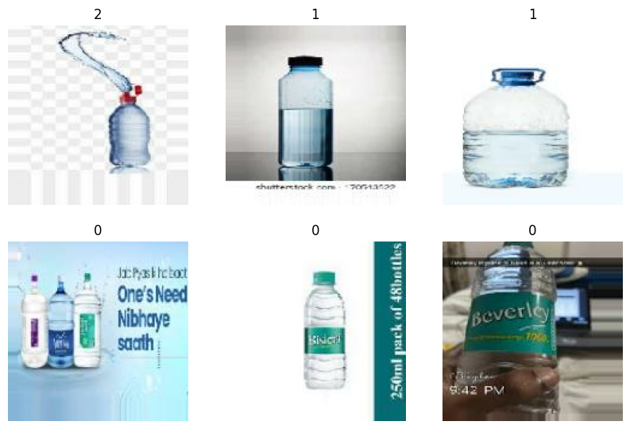

# 💧 Water Bottle Liquid Level Classification using CNN


## 📌 Project Overview
This project implements a **Convolutional Neural Network (CNN)** to classify the liquid levels in water bottles. It is designed to distinguish between different fill states (e.g., Full, Half, Overflowing) using computer vision techniques.

The model is built from scratch using **TensorFlow/Keras** and utilizes extensive **Data Augmentation** to improve generalization on small datasets.

## 🚀 Features
* **Custom CNN Architecture:** A 5-block Convolutional Neural Network with Batch Normalization and Dropout to prevent overfitting.
* **Data Augmentation:** Real-time offline augmentation using `ImageDataGenerator` (Rotation, Shift, Zoom, Brightness).
* **Automatic Splitting:** Helper scripts to split raw data into Training (80%) and Validation (20%) sets.
* **Performance Monitoring:** Visualization of accuracy and loss metrics over epochs.

## 📂 Dataset
The dataset consists of images of water bottles categorized by their liquid levels.
* **Source:** [Kaggle Water Bottle Dataset](https://www.kaggle.com/datasets/chethuhn/water-bottle-dataset)
* **Preprocessing:** Images are resized to `150x150` pixels and normalized.

## 🛠️ Tech Stack
* **Python 3.x**
* **TensorFlow & Keras:** For model building and training.
* **NumPy & Pandas:** For data handling.
* **Matplotlib:** For visualization of results.
* **Scikit-Image & PIL:** For image processing.

## ⚙️ Installation & Usage

1.  **Clone the Repository**
    ```bash
    git clone [https://github.com/goktani/Water-Bottle-Liquid-Level-Classification-CNN.git](https://github.com/goktani/Water-Bottle-Liquid-Level-Classification-CNN.git)
    cd Water-Bottle-Liquid-Level-Classification-CNN
    ```

2.  **Install Dependencies**
    ```bash
    pip install -r requirements.txt
    ```

3.  **Run the Notebook**
    You can run the project using Jupyter Notebook or Google Colab/Kaggle.
    ```bash
    jupyter notebook water-bottle-liquid-level-classification-cnn.ipynb
    ```

## 📊 Model Architecture
The model consists of a sequential stack of layers:
1.  **5x Convolutional Blocks:** Each containing Conv2D, MaxPooling2D, Dropout (0.2), and BatchNormalization.
2.  **Flatten Layer:** To convert 2D feature maps to 1D vectors.
3.  **Dense Layers:** A fully connected layer with 512 neurons.
4.  **Output Layer:** Softmax activation for multi-class classification.

## 📈 Results


## 👤 Author
**Göktan İren**
* [Kaggle Profile](https://www.kaggle.com/goktani)
* [LinkedIn](https://www.linkedin.com/in/goktani)

## 📜 Acknowledgements
Inspired by the Kaggle notebook works on CNN classifications. Special thanks to the open-source community for the dataset.
